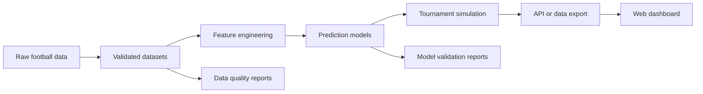

# World Cup 2026 Predictor Project Brief

## Purpose

World Cup 2026 Predictor is a professional portfolio project for predicting FIFA World Cup 2026 match outcomes with transparent, data-driven methods.

The project will combine football domain knowledge, reproducible data engineering, statistical modeling, simulation, quality automation, and a future web dashboard that explains predictions clearly.

## Goals

| Goal | Description |
| --- | --- |
| Predictive modeling | Build progressively stronger models for match outcomes and tournament scenarios. |
| Software architecture | Keep the system modular, testable, documented, and easy to extend. |
| Data quality | Track data sources, validation rules, transformations, and update risks. |
| Model validation | Evaluate models with backtesting, calibration checks, and proper scoring metrics. |
| QA automation | Add repeatable checks for code, data, models, and user-facing behavior. |
| Portfolio polish | Present the project as a clear engineering case study, not only a code repository. |

## Non-Goals

This project will not:

- Guarantee betting advice or financial outcomes.
- Treat predictions as certain or final.
- Scrape or redistribute data in ways that violate data source terms.
- Implement application logic during the documentation foundation phase.
- Prioritize a flashy dashboard over trustworthy data, modeling, and validation.

## Planned Stack

The exact stack may evolve during Phase 0.1, but the current direction is:

| Layer | Planned Options |
| --- | --- |
| Data processing | Python, pandas, Polars, or DuckDB |
| Modeling | Python, NumPy, SciPy, scikit-learn, statsmodels |
| Validation | pytest, Great Expectations or Pandera, custom model checks |
| Simulation | Python Monte Carlo simulation modules |
| API | FastAPI or a lightweight Python service |
| Dashboard | Next.js or another modern React framework |
| Storage | Local files first, then SQLite, DuckDB, or Postgres if needed |
| CI/CD | GitHub Actions |

## Architecture Direction

The project should grow in layers:

Initial architecture principles:

- Keep data ingestion separate from modeling.
- Keep model training separate from prediction and simulation.
- Make assumptions visible in docs and config.
- Store repeatable outputs in predictable locations.
- Prefer simple, explainable baselines before complex models.
- Design the dashboard around trust, comparison, and clear uncertainty.

## Quality Rules

Every meaningful phase should include:

- Clear documentation for assumptions and decisions.
- Tests for important behavior.
- Data validation for incoming and transformed datasets.
- Model validation before presenting predictions as useful.
- Reproducible commands for setup, checks, and outputs.
- Small commits with descriptive messages.

## Git Workflow

Default workflow:

1. Check `git status` before making changes.
2. Confirm the current branch.
3. Work on focused branches after the initial commit.
4. Do not overwrite unrelated local changes.
5. Stage only files related to the current task.
6. Use clear conventional commit messages.
7. Push branches to `origin` when a remote is configured.

Recommended branch naming:

- `docs/...` for documentation work
- `data/...` for data pipeline work
- `model/...` for modeling work
- `app/...` for dashboard or API work
- `test/...` for QA-only changes

## Current Phase

The current implementation track is executing the Phase 12 backlog, including immutable prediction snapshots, synchronized World Cup 2026 result ingestion into Elo, the Phase 12.9 Model vs Reality tracker for post-match evaluation, the Phase 12.11 Elo-to-xG calibration series, and the Phase 12.15 persistence work.

**Phase 12.18A (complete):** A read-only analysis phase added a pure, deterministic Prediction Usefulness Audit (`runWorldCup2026PredictionUsefulnessAudit` in `packages/api/src/prediction-usefulness-audit.ts`) that measures whether stored World Cup 2026 predictions are practically useful match-by-match — 1-1 over-prediction, draw bias and calibration, favorite separation by Elo bucket, xG compression, modal-exact-score-versus-aggregate-1X2 divergence, top-1/3/5 coverage, and upset/blowout behaviour — and emits a threshold-based recommendation. It reuses immutable stored snapshots/evaluations, never reruns the prediction model, and changes no production formula, constant, preset, provider, standings, schema, runtime, or UI. A CLI (`audit:prediction-usefulness`) writes `docs/model-results/artifacts/world-cup-2026-prediction-usefulness-audit.json` and never falls back to memory silently or prints secrets. With no stored pre-match snapshots in the queried runtime, the current measured result over 8 completed fixtures is `insufficient_evidence`; the harness is validated by 31 tests (including a hand-computed integration set) and a real verdict awaits a persistence source containing snapshots. Follow-ups 12.18B (presentation/scoreline-selection) and 12.18C (Elo-to-xG recalibration) are gated on audit evidence. See `docs/model-results/PREDICTION_USEFULNESS_AUDIT.md`.

**Phase 12.17A (complete):** A documentation/architecture-decision phase produced the multi-tournament architecture proposal without generalizing any code. `docs/architecture/ADR-0012-multi-tournament-architecture-after-validation.md` records the decision to defer all multi-tournament generalization until the live World Cup 2026 workflow is validated end-to-end, adopt a staged evidence-gated roadmap (12.17A–D), and require strictly additive, backward-compatible generalization that preserves existing routes, identifiers, version strings, and immutable snapshot/evaluation hashes (default tournament resolves to `wc2026`). `docs/architecture/MULTI_TOURNAMENT_ARCHITECTURE_PROPOSAL.md` holds the citation-anchored coupling audit across ten areas, the per-area classification, proposed future boundaries, the future database-migration strategy (additive `tournament_id`; `projection_cache` natural key becomes `(tournament_id, group_code, timezone)`; `prediction_evaluations` identity stays untouched as transitively scoped via `snapshot_id`), the immutable-hash impact analysis, the route-compatibility policy, and the risks of premature abstraction. No application code, schema, migration, test, dependency, route, or UI was changed. The model core (Elo/Poisson/Dixon-Coles/xG) is already tournament-agnostic; the product remains intentionally World Cup 2026-specific until validation evidence and a real second tournament justify implementation.

**Phase 12.15E (complete):** The persistence layer has been validated against a real non-production PostgreSQL 15 instance. Five defects found during real-environment testing were resolved: a `kickoffAt` constraint violation in test fixtures, a concurrent TRUNCATE deadlock (fixed with `vitest.config.ts` `singleFork: true`), missing `await` on async `registerSnapshotId` calls across 18 contract test sites, a JSONB double-encoding defect in all three PostgreSQL adapters (root cause: postgres.js v3 prepared statements infer JSONB OID from column schema and double-serialize pre-stringified values; fix: pass objects directly using `sql.json()`), and a `store.reset?.()` not-awaited race condition in shared contract suites. All 28 PostgreSQL contract tests pass, 6 new process-boundary tests pass, 1008 API tests pass, 72 web tests pass, typecheck is clean, and `pnpm build` succeeds. QA verdict: `production_ready`. See `docs/qa/REAL_POSTGRESQL_ENVIRONMENT_VALIDATION.md`.

**Phase 12.16 (complete):** A read-only Prediction History Dashboard now exposes persisted World Cup 2026 prediction snapshots and Model-vs-Reality evaluations at `/prediction-history`. The page supports URL-backed filters, bounded pagination, filter-scoped summary metrics, and a strict UI separation between the immutable pre-match prediction, the actual result, and the derived evaluation metrics. It works with both memory and PostgreSQL persistence modes and never creates, updates, or deletes history records.

**Phase 12.15D (complete):** The full PostgreSQL persistence layer is implemented and QA-validated. Three migrations (`prediction_snapshots`, `prediction_evaluations`, `projection_cache`) are idempotent and ready to apply. The runtime resolver selects memory or PostgreSQL adapters via `PERSISTENCE_PROVIDER`. The Group Detail SSR page uses the async projection cache with safe degradation. A webpack build regression caused by server-only `postgres` Node.js built-ins was fixed via `"sideEffects": false` in the API package and `serverExternalPackages`/`resolve.fallback` in the Next.js config. QA verdict: `ready_for_non_production`. See `docs/qa/PERSISTENCE_MIGRATION_DEPLOYMENT_QA.md` and `docs/qa/PERSISTENCE_DEPLOYMENT_CHECKLIST.md`.

**Phase 12.11E (complete):** The production Elo-to-xG formula was promoted from V1 (`adjustmentPer100=0.10`, `maxAdjustment=0.45`) to V2 (`adjustmentPer100=0.15`, `maxAdjustment=0.65`) following a three-phase calibration evaluation (Phases 12.11A–D). V2 improves holdout Brier Score by −0.0072 and Log Loss by −0.0097 over n=120 holdout matches. V1 rollback constants are preserved as named exports. Formula version metadata (`formulaVersion: "v2"`) is exposed in all prediction responses.

The ordered Phase 12 plan still lives in `docs/roadmap/PHASE_12_LIVE_DATA_MODEL_QUALITY_UX_BACKLOG.md`.
