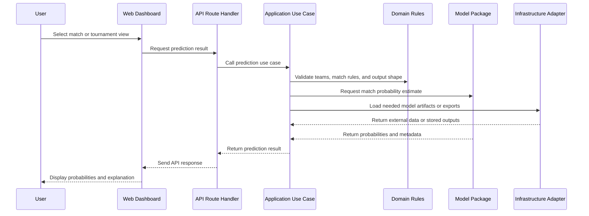
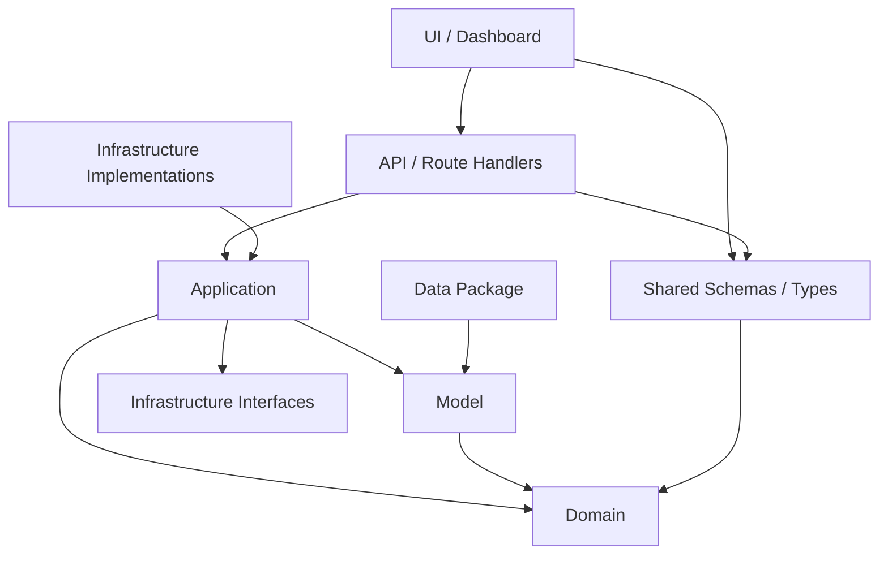
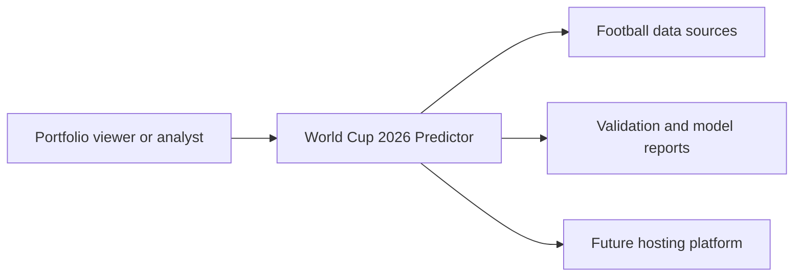
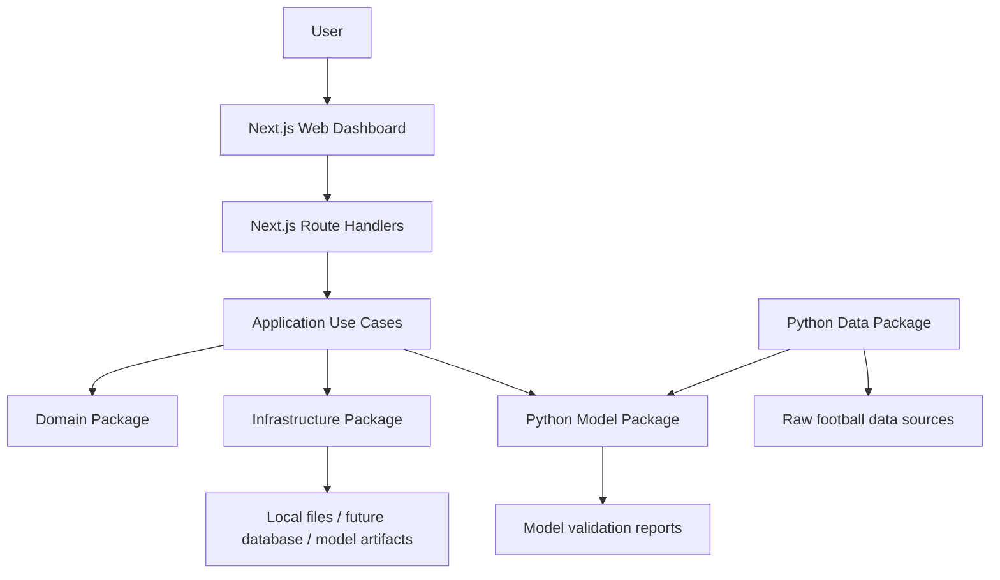
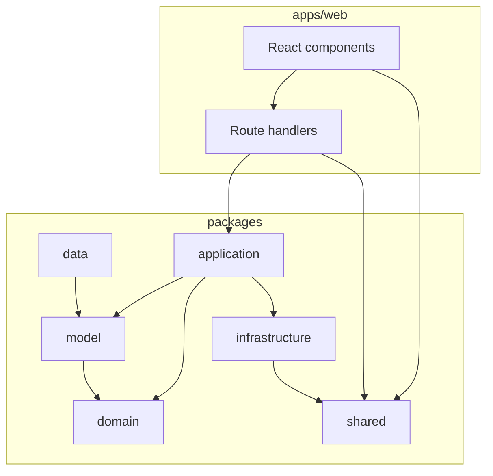

# Architecture

## Overview

World Cup 2026 Predictor will use a monorepo with Clean Architecture / Hexagonal Architecture principles.

The goal is to keep the project understandable as it grows from documentation into data pipelines, prediction models, simulations, APIs, and a future web dashboard. Each layer should have a clear job, clear dependencies, and tests that match its risk.

## Why This Architecture

This architecture was selected because the project needs to demonstrate both engineering discipline and modeling quality.

It supports:

- A future dashboard without putting business logic inside React components.
- Data and model packages that can evolve without being tied to UI framework decisions.
- Testable domain and application logic.
- Clear boundaries between prediction, simulation, data access, and presentation.
- Documentation that explains major choices through ADRs.

## Monorepo Approach

A monorepo means the dashboard, domain rules, application use cases, data tools, model code, shared schemas, tests, scripts, and documentation live in one repository.

This is useful because the project is a portfolio system, not several unrelated products. Keeping the pieces together makes it easier to coordinate changes across:

- Dashboard UI and route handlers.
- Shared prediction response shapes.
- Data validation and model inputs.
- Simulation outputs and dashboard exports.
- Tests and documentation.

The monorepo should not mean every package can depend on every other package. The dependency rules in this document still apply.

## Clean Architecture / Hexagonal Architecture

Clean Architecture and Hexagonal Architecture both focus on keeping core business rules independent from external tools.

In this project:

- The domain layer defines core football and prediction concepts.
- The application layer orchestrates use cases.
- Infrastructure handles files, databases, APIs, and other external systems.
- UI and route handlers adapt user requests into application calls.
- Data and model packages provide specialized capabilities behind clear boundaries.

Frameworks, files, databases, and web APIs should live at the edges. Core rules should be testable without starting a web server, reading a CSV file, or calling an external service.

## Planned Folder Structure

```txt
world-cup-2026-predictor/
├─ apps/
│  └─ web/                 # Next.js dashboard and API route handlers
├─ packages/
│  ├─ domain/              # Business entities and core rules
│  ├─ application/         # Use cases and orchestration
│  ├─ infrastructure/      # External integrations, repositories, file/API access
│  ├─ model/               # Python prediction models
│  ├─ data/                # ETL, datasets, data validation
│  └─ shared/              # Shared types, schemas, constants, utilities
├─ docs/
│  ├─ adr/
│  └─ ARCHITECTURE.md
└─ scripts/
```

This phase documents the intended structure only. It does not create app scaffolding, package code, dependencies, prediction logic, or data pipelines.

## System Flow

The future dashboard should ask for predictions through a thin API or route handler. The route handler should call application use cases. Application use cases should coordinate domain rules, model outputs, and infrastructure adapters.



## Layer Responsibilities

| Layer | Responsibility | Must Avoid |
| --- | --- | --- |
| UI / Dashboard | Present predictions, uncertainty, comparisons, and scenarios clearly. | Business logic, direct data access, direct model calls. |
| API / Route Handlers | Translate HTTP requests into application use case calls and return responses. | Prediction logic, data cleaning, model training, complex orchestration. |
| Application | Orchestrate use cases such as "get match prediction" or "simulate tournament". | Framework-specific code, direct UI concerns. |
| Domain | Define core entities, rules, value objects, and invariants. | Framework imports, file access, API calls, database calls. |
| Infrastructure | Implement external adapters for files, databases, APIs, repositories, and stored artifacts. | Core business decisions. |
| Data | Handle ingestion, cleaning, normalization, validation, and dataset documentation. | Dashboard UI logic, route handler logic, hidden data leakage. |
| Model | Implement prediction, backtesting, scoring, calibration, and simulation logic. | React or Next.js dependencies, direct UI formatting. |
| Shared | Hold carefully selected shared types, schemas, constants, and utilities. | Becoming a dumping ground for unrelated helpers. |

## Dependency Direction Rules

Dependencies should point inward toward stable business concepts.



Rules:

- React components must not contain business logic.
- API route handlers must be thin and must not contain prediction logic.
- UI must not access datasets, CSV files, databases, or external APIs directly.
- Domain code must remain independent from frameworks.
- Application code must orchestrate use cases.
- Infrastructure code must handle external integrations.
- Model code must isolate prediction and modeling logic.
- Data code must isolate ingestion, cleaning, and validation.
- Shared code must stay small and purposeful.
- Major architecture decisions must be documented with ADRs.

## Rules for Adding New Features

When adding a feature:

1. Identify the user or system behavior.
2. Decide which layer owns the behavior.
3. Keep UI components focused on display and interaction.
4. Put orchestration in the application layer.
5. Put core rules in the domain layer.
6. Put file, API, database, or model artifact access in infrastructure.
7. Add model or data logic only inside the matching package.
8. Add or update tests for the affected layer.
9. Update docs or ADRs if the feature changes architecture.

Examples:

| Feature | Likely Ownership |
| --- | --- |
| Display a match probability card | UI / Dashboard |
| Fetch prediction for a selected match | API handler plus application use case |
| Validate that teams are distinct | Domain |
| Load model output from disk | Infrastructure |
| Calculate Elo ratings | Model |
| Clean historical match results | Data |
| Define a prediction response schema | Shared, if used across layers |

## What Should Not Be Done

Avoid:

- Putting prediction formulas in React components.
- Putting data cleaning logic in API route handlers.
- Letting the UI read CSV files or databases directly.
- Importing Next.js or React from domain code.
- Letting `packages/shared/` become a place for unrelated helpers.
- Creating placeholder app or model code before the roadmap phase requires it.
- Introducing dependencies without a clear reason and documentation.
- Making architecture changes without updating ADRs.

## Testing Strategy by Layer

| Layer | Test Focus |
| --- | --- |
| UI / Dashboard | Component behavior, accessibility, responsive layout, E2E user flows. |
| API / Route Handlers | Request validation, response shape, error handling, application use case wiring. |
| Application | Use case orchestration, dependency boundaries, expected success and failure paths. |
| Domain | Pure rules, invariants, value objects, edge cases. |
| Infrastructure | Adapter behavior with fixtures, file/API/database error handling. |
| Data | Schema validation, freshness, duplicates, canonical IDs, cutoff dates. |
| Model | Backtesting, scoring metrics, calibration, deterministic simulation, probability bounds. |
| Shared | Schema compatibility, type validation, serialization. |

Testing should start with small deterministic fixtures. E2E tests should arrive when the dashboard exists. Model quality gates should start as reports and become stricter when metrics are stable.

## C4-Style Diagrams

### System Context



### Container Diagram



### Component / Layer Diagram



## Future Architecture Improvements

Future phases may refine:

- Exact package manager and workspace configuration.
- Python project layout and environment tooling.
- API boundary between TypeScript and Python model outputs.
- Data storage choice, such as local files, DuckDB, SQLite, or Postgres.
- Model artifact versioning.
- Dashboard deployment target.
- CI/CD workflow and quality gates.
- ADRs for data storage, validation tooling, and deployment.

Architecture should evolve deliberately. When the project needs a new pattern or dependency, document the decision and tradeoffs before spreading it through the codebase.
