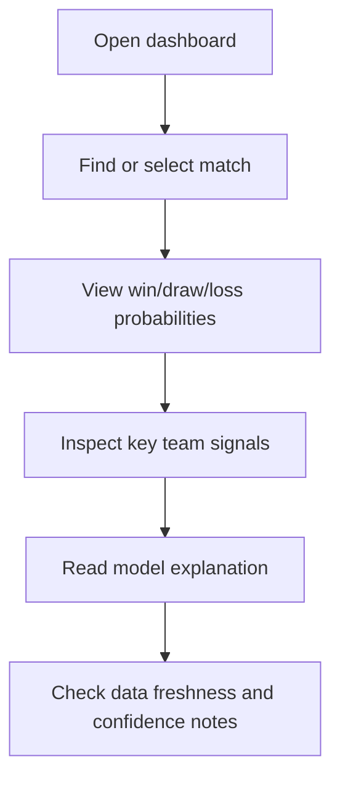
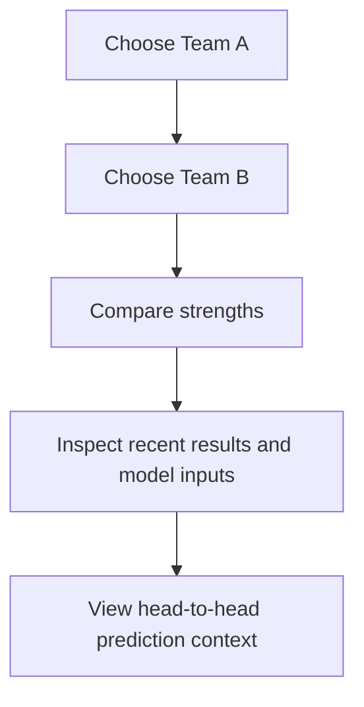
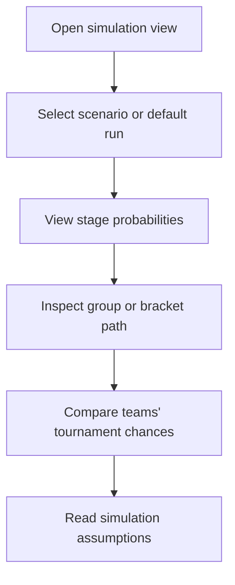
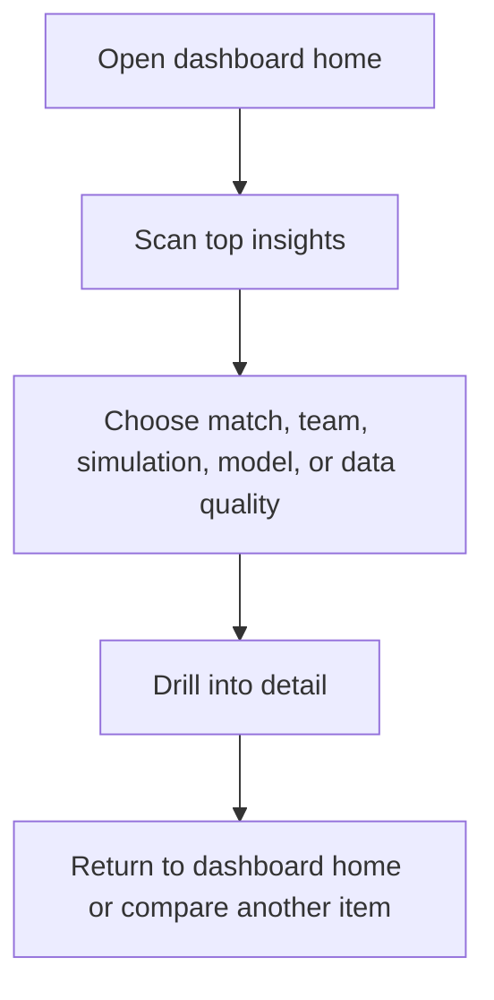

# User Flows

This document describes planned user journeys for the future dashboard. These are product discovery notes only; no UI is implemented in Phase 0.5.

## Match Prediction Flow

Goal: Help a user understand a single match prediction.

| Step | User Need | Product Response |
| --- | --- | --- |
| Select match | Find the relevant fixture quickly. | Search, filters, or match list by date/group/stage. |
| View probabilities | Understand the model's estimate. | Clear win/draw/loss cards and concise summary. |
| Inspect factors | See why the model leans a direction. | Ratings, recent form, attack/defense indicators, uncertainty notes. |
| Validate trust | Know whether data/model are current. | Data freshness, model version, validation status. |

## Team Comparison Flow

Goal: Help a user compare two teams before a match or as general analysis.

Important comparison areas:

- Elo or strength rating.
- Expected goals indicators.
- Recent results and competition context.
- Attack and defense estimates.
- Model uncertainty.
- Data completeness.

## Tournament Simulation Flow

Goal: Help a user explore tournament outcome probabilities.

Expected outputs:

- Probability to reach each stage.
- Group qualification chances.
- Knockout path probabilities.
- Winner probabilities.
- Simulation count, model version, and random seed policy.

## Dashboard Exploration Flow

Goal: Help a user browse the project without knowing exactly what they want yet.

Exploration should support:

- A clear overview of the most interesting current predictions.
- Navigation by match, team, tournament, model, and data quality.
- No dead ends.
- Simple paths back to high-level context.

## Future User Account Flow

Status: Out of scope for MVP.

Possible future account capabilities:

- Save favorite teams.
- Save scenario simulations.
- Receive alerts when model outputs update.
- Compare previous and current predictions.

Why it is out of scope:

- The MVP should prove data, modeling, validation, and dashboard quality first.
- Accounts introduce authentication, authorization, privacy, persistence, and security concerns.
- The portfolio value is stronger if the first version focuses on transparent prediction quality.
