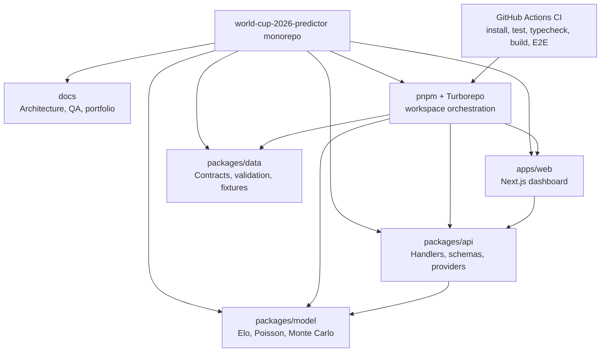
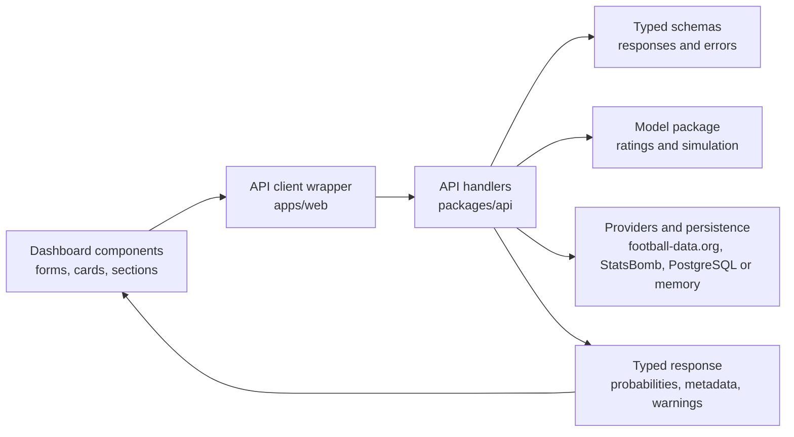
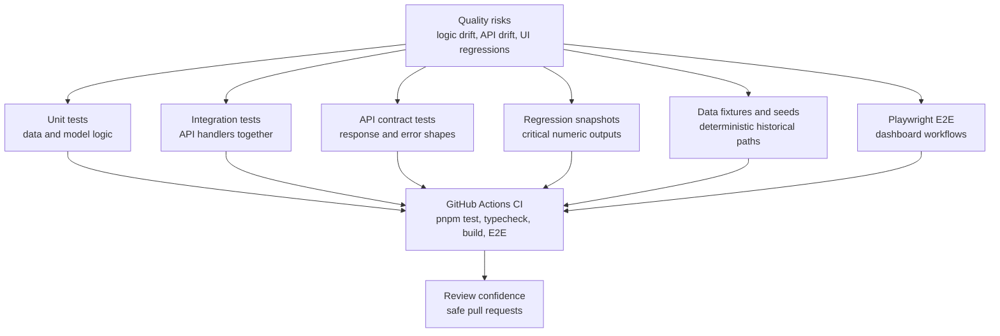

# Architecture Diagrams

Phase 9.2 adds GitHub-renderable Mermaid diagrams for portfolio and interview presentation. These diagrams summarize the current repository structure, prediction flow, API flow, QA strategy, and interview story without adding image files or changing application behavior.

## Monorepo Architecture

This diagram shows the main packages and support systems in the monorepo. The dashboard depends on API-shaped contracts and local API client wrappers, the API package composes model helpers and provider/persistence adapters, and CI validates the workspace through root pnpm/Turborepo commands. The data package remains focused on contracts, validation, and fixture foundations.

## Data-To-Prediction Flow

This diagram follows a prediction from historical fixtures through validation, Live Elo, expected-goals generation, scoreline probabilities, simulation, and final prediction output.

```mermaid
flowchart LR
    fixtures["Historical fixtures\nWorld Cup and international samples"]
    validation["Validation\nschema and required fields"]
    normalization["Normalization\nteam names and match shape"]
    liveElo["Live Elo\nteam ratings and metadata"]
    xg["Elo-to-xG\nexpected goals"]
    poisson["Poisson model\nscoreline probabilities"]
    monteCarlo["Monte Carlo\nmatch or tournament runs"]
    output["Prediction output\nprobabilities, scorelines, warnings"]

    fixtures --> validation
    validation --> normalization
    normalization --> liveElo
    liveElo --> xg
    xg --> poisson
    poisson --> monteCarlo
    poisson --> output
    monteCarlo --> output
```

## API Flow

This diagram shows how the dashboard reaches model outputs in the local monorepo path. The web app calls a local API client wrapper, which calls API handlers and returns typed responses to UI components. The same package boundaries support configured server runtime paths for persistence, provider fallback, and Vercel deployment.

## QA Strategy

This diagram groups the quality gates by risk area. Unit and integration tests protect deterministic logic, contract and snapshot tests protect API/model outputs, deterministic seeds and data fixtures protect probabilistic and historical paths, Playwright protects browser workflows, and GitHub Actions runs the core gates repeatedly.

## Interview Story

This diagram provides a concise talk track for portfolio walkthroughs. It moves from the product problem to the architecture and quality strategy, then closes with portfolio value.

```mermaid
flowchart LR
    problem["Problem\nexplainable World Cup predictions"]
    architecture["Architecture\nlayered data, model, API, UI"]
    modeling["Modeling\nElo V2, AD/SB guards, Poisson"]
    validation["Validation\nhistorical replay and snapshots"]
    automation["Automation\nunit, contract, E2E tests"]
    cicd["CI/CD\nGitHub Actions gates"]
    value["Portfolio value\nSDET-ready engineering story"]

    problem --> architecture
    architecture --> modeling
    modeling --> validation
    validation --> automation
    automation --> cicd
    cicd --> value
```

## Usage Guidance

Use these diagrams in interviews to explain the project at different depths:

| Situation | Best diagram |
| --- | --- |
| Recruiter or quick screen | Interview Story |
| Engineering architecture discussion | Monorepo Architecture and API Flow |
| Data/model discussion | Data-To-Prediction Flow |
| QA or SDET discussion | QA Strategy and API Flow |
| Portfolio README reference | Monorepo Architecture and Interview Story |

Keep the walkthrough honest: the diagrams describe the current monorepo, CI foundation, documented Vercel runtime path, provider fallback behavior, and configured PostgreSQL option. They do not claim Docker, guaranteed managed production operation, complete historical data, betting-grade predictions, custom Playwright fixtures, or a formal Page Object Model.
